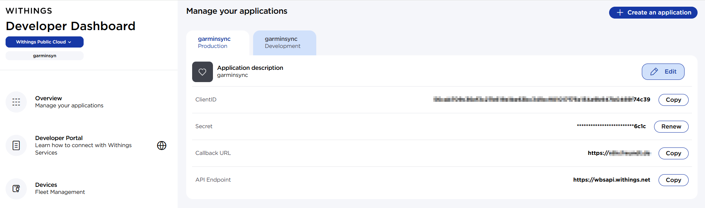

# garminsync

Sync Withings body weight measurements to Garmin Connect from a GitHub Actions workflow.

## What this does

- Authenticates to Withings API
- Fetches recent weight measurements
- Authenticates to Garmin via `garth`
- Uploads ome weight measurement to Garmin Connect
  - prefers, per day, the earliest entry that has body-composition metrics, and only falls back to the earliest weight-only entry if none with composition exists.

## Project layout

- `sync_withings_to_garmin.py` - main sync script
- `.github/workflows/sync.yml` - scheduled/manual GitHub workflow
- `requirements.txt` - Python dependencies

## Setup Overview

1. Create a Withings developer app and collect:
   - `WITHINGS_CLIENT_ID`
   - `WITHINGS_CLIENT_SECRET`
2. Complete initial OAuth once to obtain:
   - `WITHINGS_ACCESS_TOKEN`
   - `WITHINGS_REFRESH_TOKEN`
3. Add GitHub repository secrets:
   - `GARTH_OAUTH1_TOKEN_JSON`
   - `GARTH_OAUTH2_TOKEN_JSON`
   - `WITHINGS_CLIENT_ID`
   - `WITHINGS_CLIENT_SECRET`
   - `WITHINGS_ACCESS_TOKEN`
   - `WITHINGS_REFRESH_TOKEN`

## Setup Details

### Prequirements:
- browser
- curl
- python 
  - ```bash
    python -m venv .venv
    source .venv/bin/activate  # Windows: .venv\Scripts\activate
    pip install -r requirements.txt
    ```

### Details

1. Login to Withings Developer portal: https://developer.withings.com/
2. Create an app
    - Screeenshot
    - <a href="./docs/images/withings_developer_dashboard.png">
      
    </a>
    - Collect ClientID and Client Secret
    - Set Callback URL. I have used my own address https://www.mydomain.de
3. Get "code" from Withings via Browser to get Withings ACCESSTOKEN and REFRESHTOKEN in next step
- Open your browser and enter the follwing URL and replace YOUR_CLIENT_ID and YOURDOMAIN
- ```
   https://account.withings.com/oauth2_user/authorize2?response_type=code&client_id=YOUR_CLIENT_ID&scope=user.info,user.metrics,user.activity&redirect_uri=https%3A%2F%2Fwww.YOURDOMAIN.de&state=mystate
  ```
- the redirect_uri will be used to redirect you to this page you used and will add a field code in the URL. The code will be needed in the next step and is only valid for 30 seconds. You have to hurry. In my case I was redirected to:
- ```
  https://www.mydomain.de/mypage?code=4dea4697c015040386e83fe1c40c44d50a629a00&state=mystate
  ```
4. Get Withings ACCESSTOKEN and REFRESHTOKEN
- use the code retrieved from the page you were redirected to and replace it alongside with other placeholders like "YOUR_CLIENT_ID", "YOUR_CLIENT_SECRET", "YOURDOMAIN"
- ```curl
  
  curl --data "action=requesttoken&grant_type=authorization_code&client_id=YOUR_CLIENT_ID&client_secret=YOUR_CLIENT_SECRET&code=4dea4697c015040386e83fe1c40c44d50a629a00&redirect_uri=https%3A%2F%2Fwww.YOURDOMAIN.de" 'https://wbsapi.withings.net/v2/oauth2'
  ```
- the redirect URI from step4 and the redirect from step3 have to be exactly the same. 
  - redirect_uri=https%3A%2F%2Fwww.YOURDOMAIN.de for both works
  - redirect_uri=https%3A%2F%2Fwww.YOURDOMAIN.de for one and the other like redirect_uri=https://www.YOURDOMAIN.de does not work
- ```linux
  root@Desktop:/mnt/c/Users/chris# curl --data "action=requesttoken&grant_type=authorization_code&client_id=YOUR_CLIENT_ID&client_secret=YOUR_CLIENT_SECRET&code=4dea4697c015040386e83fe1c40c44d50a629a00&redirect_uri=https%3A%2F%2Fwww.YOURDOMAIN.de" 'https://wbsapi.withings.net/v2/oauth2'
  
  {"status":0,"body":{"userid":"46865875","access_token":"ALPHANUMERICALACCESSTOKEN","refresh_token":"ALPHANUMERICALREFRESHTOKEN","scope":"user.info,user.metrics,user.activity","expires_in":10800,"token_type":"Bearer"}}
  
  root@Desktop:/mnt/c/Users/chris#
  ```
5. Get GARTH_OAUTH1_TOKEN_JSON and GARTH_OAUTH2_TOKEN_JSON from Garmin, MFA is required once
- I used powershell
- ```powershell
  $env:GARMIN_EMAIL="you@example.com"
  $env:GARMIN_PASSWORD="your-garmin-password"
  python bootstrap_garth_session.py
  ```
- result should look something like this:
- ```powershell
  PS C:\Users\chris\Github\garminsync> docker run --rm -it --env-file .env garminsync python bootstrap_garth_session.py
  Logging into Garmin. If MFA is enabled, enter the code when prompted.
  MFA code: 307835
  Saved Garmin session files to /workspace/.garth
  Create these GitHub repository secrets with exact values:
  GARTH_OAUTH1_TOKEN_JSON={
      "oauth_token": "anoauthtoken",
      "oauth_token_secret": "anoauthtokensecret",
      "mfa_token": "MFA-token",
      "mfa_expiration_timestamp": "2027-02-27T14:31:29",
      "domain": "garmin.com"
  }
  GARTH_OAUTH2_TOKEN_JSON={
      "scope": "OMT_DISCOUNTS_READ GARMINPAY_WRITE ATP_READ GHS_SAMD INSIGHTS_READ OMT_DISCOUNTS_CREATE CIQ_APPSTORE_SERVICES_CREATE DI_TOUM_NATIVE_REPORTED_DETAIL_WRITE COMMUNITY_COURSE_WRITE GCOFFER_WRITE DT_CLIENT_ANALYTICS_WRITE CIQ_APPSTORE_SERVICES_DELETE OMT_SUBSCRIPTION_READ CONNECT_READ GARMIN_PROFILE_READ COMMUNITY_COURSE_READ GOLF_API_READ GHS_UPLOAD DIVE_API_READ CIQ_APPSTORE_SERVICES_READ CIQ_APPSTORE_SERVICES_UPDATE CONNECT_WRITE CONNECT_MCT_DAILY_LOG_READ DI_OAUTH_2_AUTHORIZATION_CODE_CREATE GARMINPAY_READ GOLF_API_WRITE INSIGHTS_WRITE PRODUCT_SEARCH_READ OMT_CAMPAIGN_READ GCOFFER_READ ATP_WRITE",
      "jti": "2a35986e-fe24-4895-8343-66f33b4ede22",
      "token_type": "bearer",
      "access_token": "anaccesstokenwillbehere",
      "expires_in": 90920,
      "expires_at": 1772293613,
  NDUxLTRkZWUtOGVkMC1hZWEyZGJjYmRjOTIifQ==",
    "expires_in": 90920,
    "expires_at": 1772293613,
    "refresh_token_expires_in": 2591999,
    "refresh_token_expires_at": 1774794692
    "expires_at": 1772293613,
    "expires_at": 1772293613,
    "refresh_token_expires_in": 2591999,
    "refresh_token_expires_at": 1774794692          "expires_at": 1772293613,
    "refresh_token_expires_in": 2591999,
    "refresh_token_expires_at": 1774794692          "expires_at": 1772293613,
    "refresh_token_expires_in": 2591999,        
    "refresh_token_expires_at": 1774794692         "refresh_token_expires_in": 2591999,       
    "refresh_token_expires_at": 1774794692     
    "refresh_token_expires_in": 2591999,      
    "refresh_token_expires_at": 1774794692    
  }
  ```
6. Copy .env.example to .env, replace all PLACEHOLDERS, run it locally to test it first
 - I tested it within powershell and used a small additional script to load the environment varibles into the current PS session
 - ```powershell
    .\Set-EnvFromDotEnv.ps1 ##bash source .env
   ```
 - ```powershell
   PS C:\Users\chris\Github\garminsync> python .\sync_withings_to_garmin.py
   Withings access token was refreshed.
   Withings refresh token was refreshed. Update your GitHub secret WITHINGS_REFRESH_TOKEN.
   Found 2 weight entries from Withings.
   Using FIT upload path (weight + available body composition metrics).
   Garmin session resumed from GARTH_OAUTH*_TOKEN_JSON secrets.
   Uploaded: 2026-02-27T12:25:46+01:00 -> 75.672 kg
   Uploaded: 2026-02-28T19:00:03+01:00 -> 75.237 kg
   Sync complete. Uploaded=2, Skipped=0
   ```
7. Store those as GitHub repository secrets. After that, scheduled workflow runs can authenticate without interactive MFA.

## Notes

- This implementation syncs weight for the last 7 days by default.
- If Garmin session secrets are missing, the script falls back to `GARMIN_EMAIL` and `GARMIN_PASSWORD` login.
- GitHub Actions cannot persist refreshed Withings tokens unless you update secrets. For durable operation, rotate secrets with newly refreshed tokens periodically, or run this somewhere with persistent storage.
